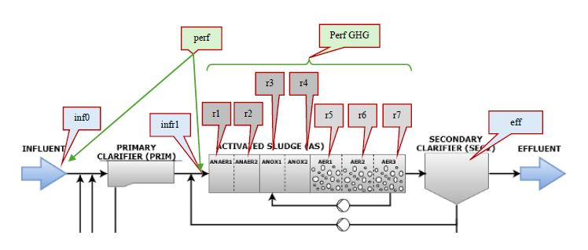

# Model-prediction-of-site-level-N2O-emissions-during-wastewater-treatment.

## Overview

This procedure was implemented to both real dataset For more details, [click here](https://doi.org/10.1016/j.scitotenv.2015.06.122) and synthethic dataset from the mechanistic model For more details, [click here](https://github.com/wwtmodels/Benchmark-Simulation-Models). This repository contains machine learning workflows for predicting **N2O emissions** in **wastewater treatment plants (WWTPs)** using data generated from a **mechanistic model** **(MCM)**. 

Five regression algorithms are implemented in this project:

- XGBoost
- Random Forest
- AdaBoost
- SVR
- KNN
A separate preprocessing script is also included for exploratory analysis and data preparation prior to model training.


## Scenario Description

## Mechanistic Model

The figure below illustrates the mechanistic model used to generate the simulated dataset for this scenario.



Based on this model, both process variables and N2O emission data were generated for the machine learning analysis.

In this scenario, N2O emissions were reported at **15-minute intervals**, resulting in **34,944 samples**. This sampling frequency was selected to remain practical and consistent with real operational conditions.

The target variable in this study is `G_N2O_r5`, which represents the **gas emissions from reactor 5**.


## Selected Variables

In this scenario, **12 input features** were analyzed as the main variables potentially influencing **N2O emissions**.

The selected input features are:

- `NH4_r7`
- `NO2_r7`
- `NO3_r7`
- `DO_r5`
- `DO_r6`
- `DO_r7`
- `NH4_r5`
- `NO3_r5`
- `TSS_r7`
- `Temp_inf`
- `Flow_inf`
- `Tnload_inf`


## Preprocessing

The preprocessing script is used for initial data exploration and preparation. It includes dataset inspection, visualization, distribution and correlation analysis, stationarity and lag checks, log transformation, and time-based splitting to support the modelling workflow.


## Modelling Workflow

Each model follows a structured workflow that includes:

1. Data preparation
2. Train-test split
3. Model training and test set evaluation
4. Learning curve analysis
5. Feature importance analysis
6. Residual analysis over time
7. Zero-bias regression plot

Some scripts may also include a hyperparameter optimization section for methodological completeness.

## Evaluation Metrics

Model performance is evaluated using:

- MSE
- R²
- MAE
  

## Requirements

Main Python libraries used in this project:

- numpy
- pandas
- matplotlib
- seaborn
- scikit-learn
- statsmodels
- xgboost


## Repository Structure
```text
├── preprocessing/
│   └── preprocessing_model.py
├── xgboost/
│   └── xgboost_model.py
├── random_forest/
│   └── random_forest_model.py
├── adaboost/
│   └── adaboost_model.py
├── svr/
│   └── svr_model.py
├── knn/
│   └── knn_model.py
├── data/
│   └── Scenario_1_Recorrect.csv
└── README.md

